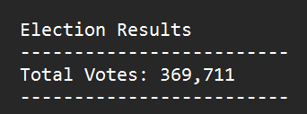
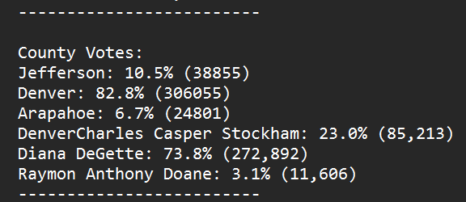
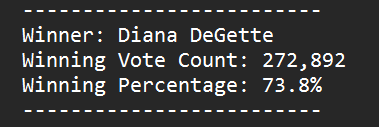

# # Election Analysis with Python

## Overview of Election 
The purpose of this project is to help project the winnning candidate in an election race. 
Votes were taken from three different counties and was used to determine the total number of
votes, as well as the county with the highest number of votes. In addition, votes were tallied
for each of the three candidates, to determine which candidate had the highest number of votes
and would be named the winner of the election.

## Election Audit Results
- **Total Votes Cast:**

- **Total Votes by County and Candidate and Percentage of Votes:**

- **Winning Candidate's Total Vote Count and Percentage of Votes:**

### Breakdown by County
Denver County had the highest voter turnout with 306,055 votes out of 369,711 votes total.
That's approximately 83% of the votes. On the other hand, Jefferson county only accounted 
for 38,855 of the votes, followed by Arapahoe County with 24,801 votes. Jefferson and 
Arapahoe county makeup roughly 17% of the voter turnout combined, which is drastically 
less than Denver County.

### Breakdown by Candidate
Diana DeGette had the highest voter turnout with 272,892 votes out of 369,711 total votes.
Candidate Diana Degette received approximately 74% of the votes. Charles Casper Stockham
trailed behind in second, only receiving 85,213 followed by Raymond Anthony Doane with only
11,606 votes. Candidates Charles Casper Stockham and Raymond Anthony Doane received a combined
total of approximately 26% of votes, which is significantly less than Candidate Diana DeGette.

### Breakdown of Winning Candidate's Votes
The winner of the election was Diana DeGette, receiving majority of votes.

  - Votes Received: 272,892

  - Vote Percentage: 73.8%

## Election Audit Summary
The following script can be used to determine a winner for any election and is efficient 
and effective. This script allows the computer to determine the number of total votes,
percentage of votes per county and per candidate, then spews out the winning candidate
based on the code written within the script. Using this method saves time and could
results in less errors compared to having this information inputted manually or 
counted manually by one person or persons. Now, if you choose to use this script for 
future elections, a few things would have to change. For instance, the csv file would be
different and would have to be updated within the script. Another small modification, 
would be changing county to state, city, etc. based on what kind of election you would
be using this code for. But this script could be useful and go a long way if tweaked and
tailored to a specific election.
